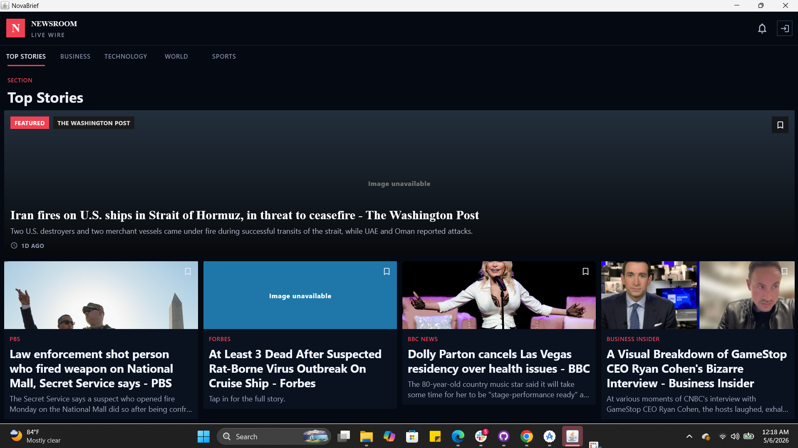

# NovaBrief

## Overview

NovaBrief is a multiplatform news app built with Kotlin Multiplatform and Jetpack Compose. It fetches live headlines from NewsAPI, caches articles locally for offline reading, and presents them in an editorial-style interface with animated feed and detail experiences. The project demonstrates modern Android and web (JS) development with shared business logic and UI patterns.


## App Type

This project implements the `News App` option from the task brief.
## Platform Adaptation & Support

NovaBrief is designed as a multiplatform project:

- **Android**: Native app using Jetpack Compose, Room, and other Android libraries.
- **Web (JS)**: Compose Multiplatform for web UI, sharing business logic and presentation code with Android.

The codebase is organized to maximize code sharing between platforms, with platform-specific modules for UI and integration.

**Supported Platforms:**
- Android 6.0+
- Modern desktop browsers (for JS/web preview)

See the `shared/` and `app/` modules for multiplatform structure.

## Features

- Live news feed powered by NewsAPI
- Category browsing for `Top Stories`, `Business`, `Technology`, `World`, and `Sports`
- Editorial feed UI with featured story and article cards
- Article detail screen with themed long-form reading layout
- Offline caching with Room so previously fetched stories remain available
- Clear loading, empty, retry, and offline states
- Personalization screen for selecting newsroom interests
- External source continuation via `CONTINUE READING`

## APIs Used

- [NewsAPI](https://newsapi.org/)
  - `v2/top-headlines`
  - `v2/everything`

## Offline Caching

NovaBrief uses Room to cache fetched articles by category. When the device goes offline:

- cached articles remain visible
- the app shows an offline status banner if refresh fails but saved stories exist
- the app shows a dedicated no-internet retry state if nothing is cached yet

Relevant files:

- [NewsDatabase.kt](app/src/main/java/com/example/novabrief/feature/news/data/local/NewsDatabase.kt)
- [NewsDao.kt](app/src/main/java/com/example/novabrief/feature/news/data/local/NewsDao.kt)
- [NewsApiRepository.kt](app/src/main/java/com/example/novabrief/feature/news/data/repository/NewsApiRepository.kt)

## Error Handling

The app includes user-facing handling for:

- no internet connection
- cached offline mode after a failed refresh
- API rate limit responses
- upstream server failures
- missing API key/configuration
- empty category results

Retry actions are provided from the feed error state.

## Loading States

- initial full-screen loading indicator for first fetch
- cached-content-first behavior to avoid unnecessary flicker
- inline refresh warning banner when refresh fails but cached articles are available

## Animation Highlights

NovaBrief includes intentional motion in multiple areas:

- animated feed item entrance using staggered fade/offset transitions
- animated detail/feed navigation transitions through Compose navigation flow
- animated category/feed presentation for a smoother loading experience

Relevant UI files:

- [NewsScreen.kt](app/src/main/java/com/example/novabrief/feature/news/presentation/NewsScreen.kt)
- [NewsDetailScreen.kt](app/src/main/java/com/example/novabrief/feature/news/presentation/NewsDetailScreen.kt)

## UI/UX Notes

- dark newsroom-inspired editorial visual style
- featured headline treatment for the top story
- themed detail page designed around article readability
- strong visual hierarchy for source, time, summary, and body content

## Architecture

The app uses a lightweight layered structure:

- `presentation`: Compose screens and view models
- `domain`: models and use cases
- `data`: repository, API service, DTOs, and local cache

Pattern:

- MVVM-style state management with `StateFlow`
- Repository pattern for remote/local coordination

## Libraries and Dependencies

- Jetpack Compose
- Navigation Compose
- ViewModel
- Room
- Retrofit
- Gson
- OkHttp Logging Interceptor
- Coil
- Kotlin Coroutines / Flow

## Project Structure

```text
app/src/main/java/com/example/novabrief/
  core/
    navigation/
    preferences/
    designsystem/
  feature/
    news/
      data/
      domain/
      presentation/
    personalization/
      presentation/
```


## Screenshots & Demo


## Demo & Links
- [Appetize Public Preview](https://appetize.io/app/b_gk7zcey3vvww6nroz6idjejt64)
- [NovaBrief Demo Desktop](https://drive.google.com/file/d/1al0lZj0cwzdyAlYegHtkbA0x2Q9Y5GvX/view?usp=sharing)
- [NovaBrief Demo Web](https://drive.google.com/file/d/1al0lZj0cwzdyAlYegHtkbA0x2Q9Y5GvX/view?usp=sharing)

